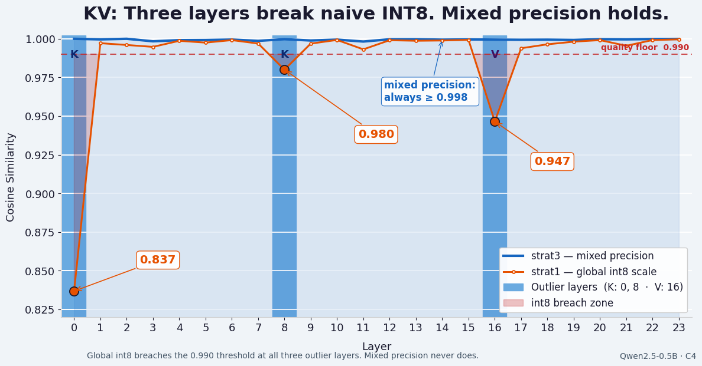

## kvmix — KV cache mixed-precision quant benchmark

Benchmarks int8 quantization strategies on the KV cache of Qwen2.5-0.5B (fp16), using post-RoPE K, V, and Q tensors across 24 layers, 2 GQA heads, 4096 tokens.

Motivated by DeepSeek's sparse-attention KV compression — exploring a different angle: per-layer mixed precision on an existing open model.

**The cast bug:** `(int8_t) x` vs `(int8_t) nearbyintf(x)`. The naive form truncates toward zero, introducing ~4x MSE. Nearly universal in C/C++ quant code.



### Build & run
```
make
./run.sh [corpus] [strategy] [csv_bool]                          # e.g. ./run.sh c4 2 true
uv run plot_quant.py [corpus]                                    # line chart: norm MSE by layer
uv run heatmap.py [corpus]                                       # heatmap: compression by layer & head
uv run bytes_per_token.py                                        # cache size table
uv run validate_attn.py [corpus] [strategy] [layers] [csv_bool] # attention output error
```

Corpora: `wikitext` (wikitext-2-raw-v1 test), `c4` (allenai/c4 en validation)

### Strategies
- **strat1** — global int8 scale per head (one scale over all tokens)
- **strat2** — per-token int8 scale per head
- **strat3** — mixed: fp16 for outlier K heads, int8 (per-token) for V, int8 (global) for stable K heads

### Key findings

**V is ~50x more compressible than K.** Values quantize cleanly across all layers; keys are dominated by outliers.

**6 of 48 layer-head pairs carry the bulk of K error.** Outliers at (layer,head) = (0,0),(0,1),(1,1),(2,0),(2,1),(8,0). Pattern reproduced identically across both corpora — model trait, not data artifact.

**Compression must preserve attention semantics, not just minimize tensor MSE.** Validation computes full causal attention with original vs quantized K/V, measuring NMSE and cosine similarity on the output vectors.

**Uniform int8 on K collapses attention at outlier layers:**

| strategy | layer 0 cos | layer 8 cos | layer 16 cos |
|---|---|---|---|
| strat1 (uniform int8 K) | 0.837 | 0.980 | 0.947 |
| strat3 (mixed precision) | 0.999 | 0.999 | 0.999 |

**strat3: 45% memory savings, cos_sim ≥ 0.998 across all 24 layers.**
FP16 on 6 outlier K heads + int8 elsewhere. Worst-layer attention NMSE: 2.2e-3 (layer 11, cos=0.998).

### Cache size
| strategy | bytes/token | 4096-tok cache |
|---|---|---|
| fp16 baseline | 12,288 | 48.0 MB |
| strat1 (global int8) | 6,144 | 24.0 MB |
| strat2 (per-token int8) | 6,528 | 25.5 MB |
| strat3 (mixed precision) | 6,720 | 26.2 MB |

### Limitations
Single model. Validated on C4. NMSE and cos_sim are proxies for downstream task quality. Open question: does preconditioning extend the result to other model families?

### Files
- `quant.c` — quantization benchmark (hand-built)
- `dump_kv.py` / `dump_kv_c4.py` — dump post-RoPE K/V/Q from model
- `plot_quant.py [corpus]` — line chart of norm MSE by layer
- `heatmap.py [corpus]` — 4-row heatmap (K/V × head)
- `bytes_per_token.py` — bytes/token per strategy
- `validate_attn.py [corpus] [strategy] [layers] [csv_bool]` — attention NMSE/cos-sim, orig vs quantized K/V
